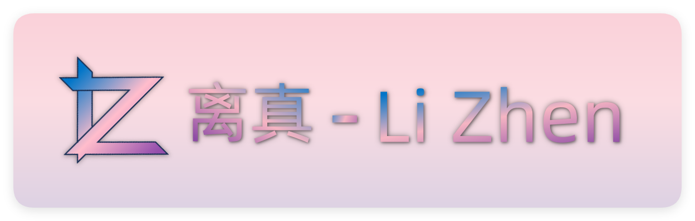

<h1 align="center">离真 - Li Zhen</h1>

---

<h3 align="center">

[](./LICENSE)
[](https://github.com/Stewitch/LiZhen/releases)
[](https://github.com/Stewitch/LiZhen/issues)
[](https://github.com/Stewitch/LiZhen/pulls)

[](https://github.com/Stewitch/LiZhen/forks)


中文 README | [English README](./README.EN.md)

</h3>

---

>[!NOTE]
>当前为 `next` 分支，即重构代码提交分支

---

## ❓ 这是什么项目

**离真** 是为 [Open-LLM-VTuber](https://github.com/Open-LLM-VTuber/Open-LLM-VTuber) 项目所设计的一个现代化启动器。基于 Python 开发，使用 PySide6 UI框架和 [PySide6-Fluent-Widgets](https://github.com/zhiyiYo/PyQt-Fluent-Widgets/tree/PySide6) 组件库。旨在为项目提供快速启动、可视化配置等服务。致力于为 **Windows用户** 打造更加舒适的项目体验。

**注意: 本文后续以 ‘项目’ 代指 ‘Open-LLM-VTuber 项目’**

---

## 🌟 特色

- 🖱️ **一键启动:** 仅需按下按钮，启动器会自动进入虚拟环境并启动项目，无需手动输入命令。
- ⚙️ **可视化配置:** 修改配置文件太复杂？不知各项之间的联系？启动器将配置分开管理，并利用开关、下拉列表框等控件让配置更加容易。
- 📄 **自动配置虚拟环境:** 每次启动项目时，启动器会自动执行 uv 虚拟环境的命令对环境进行检测，以使其时刻符合项目依赖要求。
- 📥 **下载部分依赖:** 目前启动器可以自动配置 uv 虚拟环境工具，无需手动下载安装。
- 📓 **信息展示:** 在启动页面展示当前选中的角色、Live2D模型、ASR/LLM/TTS提供者以及模型等信息，方便用户确认。
- 🎛️ **项目/启动器 控制台:** 在启动器中查看 项目/启动器 的运行状态，并可快速导出日志，便于问题提交。
...

---

## 🖥️ 系统需求

- Windows 10/11 22H2 或 更新版本
- 其他与 项目 保持一致

---

## ℹ️ 文件结构

**注意:** 以 Releases 为基础，省略了一些文件结构

**不包括 `Open-LLM-VTuber` 文件夹**
> - /launcher
>   - /assets
>   - /configs
>   - /logs
> - lizhen.exe
> - updater.exe

**包括 `Open-LLM-VTuber` 文件夹**
> - /launcher
>   - /assets
>   - /configs
>   - /logs
> - /Open-LLM-VTuber
>   - ...
> - lizhen.exe
> - updater.exe

---

## ▶️ 快速开始

#### Release
1. **请确认下载并完整解压了项目文件夹，且配置了 FFMpeg (N卡用户还需配置 CUDA、CUDNN)**，可参考 [项目文档#环境准备](https://open-llm-vtuber.github.io/docs/quick-start/#%E7%8E%AF%E5%A2%83%E5%87%86%E5%A4%87)，Git 和 Python环境 可以不用管
> 如果您的项目文件夹名是 `Open-LLM-VTuber-vX.X.X`，记得把它重命名为 `Open-LLM-VTuber`
2. 下载最新版本的启动器 Release 包 (.zip文件)
3. 将其中文件完整解压到于项目文件夹同一级的文件夹中 (请参照 文件结构#包括 `Open-LLM-VTuber` 文件夹)
4. 双击运行 `lizhen.exe`
5. 首次启动时会询问是否创建桌面快捷方式，您也可以在 `设置` 里手动创建快捷方式

#### Source
1. 在 **Release** 的第 1 步的基础上安装 Python 3.12.x
2. 使用 Git 克隆本仓库:
```batch
git clone https://github.com/Stewitch/LiZhen.git
```
3. 在文件资源管理器中打开刚刚克隆下来的仓库目录，将其中文件复制到与项目文件夹同级目录下 (请参照 文件结构#包括 `Open-LLM-VTuber` 文件夹)
4. 安装项目依赖:
```batch
pip install -r requirements.txt
rem 对于国内用户：若下载速度较慢，可尝试设置清华源后重新安装
pip config set global.index-url https://mirrors.tuna.tsinghua.edu.cn/pypi/web/simple
rem 设置完后再次执行第一条命令
```
5. 启动 main.py，在 Python环境 配置好的情况下可直接双击运行，或使用命令
```batch
python main.py
```

---

## 🫡 致谢
- **@t41372** [Open-LLM-VTuber](https://github.com/Open-LLM-VTuber/Open-LLM-VTuber)
- **@zhiyiYo** [PySide6-Fluent-Widgets](https://github.com/zhiyiYo/PyQt-Fluent-Widgets/tree/PySide6)

---

## ⚡️ 支持
如果你想支持我更好地开发<del>（存疑）</del>，可以前往我的 [爱发电主页](https://afdian.com/a/Stewitch) 进行支持💖
我会把国内的网盘下载链接贴在那里（公开的！不用支持也能下！）

---

## ⭐ Star History

[](https://star-history.com/#Stewitch/LiZhen&Date)
